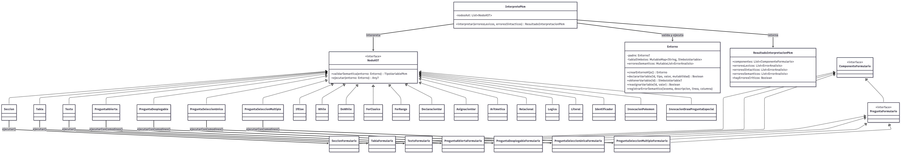

# Centro Universitario de Occidente - USAC | Primer Semestre 2026
## Documentación - Proyecto 1: PKM_FORMS_EH
## Organización de Lenguajes y Compiladores 1
### Ing. Moises Granados

**Nombre:** Enrique Alexander Tebalan Hernandez | **Carnet:** 202230026
---

## 1. Introducción al desarrollo del proyecto

El proyecto **PKM_FORMS_EH** consiste en una aplicación Android para crear y visualizar formularios mediante un lenguaje específico de dominio (DSL). La solución integra desarrollo móvil con conceptos formales de compiladores: análisis léxico, análisis sintáctico, validación semántica, construcción de AST e interpretación.

La arquitectura se organizó en capas para separar responsabilidades y facilitar mantenimiento. La interfaz de usuario se implementó con Jetpack Compose, la persistencia local con Room, el consumo de API externa con Retrofit, y el compilador con JFlex + CUP + AST en Kotlin.

---

## 2. Organización del proyecto

La organización principal del repositorio se resume en el siguiente árbol:

```text
Proyecto1_COMPI1_PS2026/
├── app/
│   ├── src/main/
│   │   ├── java/com/usac/pkmforms/
│   │   │   ├── MainActivity.kt
│   │   │   ├── compilador/
│   │   │   │   ├── ast/nodos/
│   │   │   │   │   ├── NodoAST.kt
│   │   │   │   │   ├── NodosEstructurales.kt
│   │   │   │   │   ├── NodosPreguntas.kt
│   │   │   │   │   ├── NodosControl.kt
│   │   │   │   │   ├── NodosExpresion.kt
│   │   │   │   │   ├── NodosVariables.kt
│   │   │   │   │   └── ConversorAtributosAST.kt
│   │   │   │   ├── interprete/
│   │   │   │   │   ├── Entorno.kt
│   │   │   │   │   └── InterpretePkm.kt
│   │   │   │   ├── lexer/        (código generado)
│   │   │   │   └── parser/       (código generado)
│   │   │   ├── ui/pantallas/
│   │   │   │   ├── editor_codigo/EditorPantalla.kt
│   │   │   │   ├── visor_formulario/RenderizadorPantalla.kt
│   │   │   │   └── lista_formularios/ListaFormulariosPantalla.kt
│   │   │   ├── data/
│   │   │   │   ├── base_datos/
│   │   │   │   │   ├── AppDatabase.kt
│   │   │   │   │   ├── dao/FormularioDao.kt
│   │   │   │   │   └── entidades/FormularioGuardadoEntity.kt
│   │   │   │   └── repositorios/FormularioRepository.kt
│   │   │   ├── domain/modelo/
│   │   │   │   ├── formulario/
│   │   │   │   ├── preguntas/
│   │   │   │   ├── seccion/
│   │   │   │   └── tabla/
│   │   │   ├── servicios/cliente_api_pokemon/
│   │   │   │   ├── PokeApiClient.kt
│   │   │   │   ├── PokeApiService.kt
│   │   │   │   └── PokemonListResponse.kt
│   │   │   └── utilidades/
│   │   │       ├── GestorArchivosLocal.kt
│   │   │       ├── manejador_errores/ErrorAnalisis.kt
│   │   │       └── serializador_pkm/SerializadorPkm.kt
│   │   ├── jflex/com/usac/pkmforms/compilador/lexer/LexerPkm.flex
│   │   ├── cup/com/usac/pkmforms/compilador/parser/ParserPkm.cup
│   │   └── AndroidManifest.xml
│   └── build.gradle.kts
├── build.gradle.kts
├── settings.gradle.kts
├── ManualTecnico.md
└── ManualUsuario.md
```

---

## 3. Análisis de gramática

### 3.1 Analizador léxico (JFlex)

#### 3.1.1 Tokens de palabras reservadas y componentes

| Token / Nombre | Patrón / Lexema | Descripción |
|---|---|---|
| TIPO_NUMBER | `number` | Tipo primitivo numérico |
| TIPO_STRING | `string` | Tipo primitivo de cadena |
| TIPO_SPECIAL | `special` | Tipo especial para componentes/preguntas |
| SECTION | `SECTION` | Inicio de componente sección |
| TABLE | `TABLE` | Inicio de componente tabla |
| TEXT | `TEXT` | Componente de texto |
| OPEN_QUESTION | `OPEN_QUESTION` | Pregunta abierta |
| DROP_QUESTION | `DROP_QUESTION` | Pregunta desplegable |
| SELECT_QUESTION | `SELECT_QUESTION` | Pregunta de selección única |
| MULTIPLE_QUESTION | `MULTIPLE_QUESTION` | Pregunta de selección múltiple |
| IF / ELSE / WHILE / DO / FOR | `IF`, `ELSE`, `WHILE`, `DO`, `FOR` | Estructuras de control |
| IN | `in` | Operador de rango para `FOR` |
| DRAW | `draw` | Invocación de plantilla especial |
| WHO_IS_THAT_POKEMON | `who_is_that_pokemon` | Invocación externa de opciones |

#### 3.1.2 Tokens de atributos y estilo

| Token / Nombre | Patrón / Lexema | Descripción |
|---|---|---|
| WIDTH / HEIGHT | `width`, `height` | Dimensiones de componentes |
| POINT_X / POINT_Y | `pointX`, `pointY` | Coordenadas de ubicación |
| ORIENTATION | `orientation` | Orientación de layout |
| VERTICAL / HORIZONTAL | `VERTICAL`, `HORIZONTAL` | Valores de orientación |
| ELEMENTS | `elements` | Lista de hijos visuales |
| STYLES | `styles` | Bloque de estilos |
| CONTENT | `content` | Contenido textual |
| LABEL | `label` | Etiqueta de pregunta |
| OPTIONS | `options` / `OPTIONS` | Lista de opciones |
| CORRECT | `correct` / `CORRECT` | Respuesta correcta |
| FONT_FAMILY | `"font family"` | Familia de fuente |
| TEXT_SIZE | `"text size"` | Tamaño de texto |
| BORDER | `"border"` | Estilo de borde |
| COLOR | `"color"` | Color de texto |
| BACKGROUND_COLOR | `"background color"` | Color de fondo |

#### 3.1.3 Operadores y símbolos

| Token / Nombre | Patrón / Lexema | Descripción |
|---|---|---|
| MAS / MENOS / POR / DIV | `+`, `-`, `*`, `/` | Operaciones aritméticas |
| POTENCIA / MODULO | `^`, `%` | Potencia y módulo |
| MAYOR / MENOR | `>`, `<` | Comparaciones |
| MAYOR_IGUAL / MENOR_IGUAL | `>=`, `<=` | Comparaciones |
| IGUAL_IGUAL / DIFERENTE | `==`, `!!` | Igualdad / diferencia |
| AND / OR / NOT | `&&`, `\|\|`, `!` | Operadores lógicos |
| PAREN_ABRE / PAREN_CIERRA | `(`, `)` | Paréntesis |
| LLAVE_ABRE / LLAVE_CIERRA | `{`, `}` | Llaves |
| CORCHETE_ABRE / CORCHETE_CIERRA | `[`, `]` | Corchetes |
| COMA / PUNTO_COMA / DOS_PUNTOS | `,`, `;`, `:` | Separadores |
| RANGO | `..` | Operador de rango |
| PUNTO | `.` | Acceso a miembro |
| IGUAL | `=` | Asignación |
| COMODIN | `?` | Valor comodín |

#### 3.1.4 Literales, identificadores y comentarios

| Token / Nombre | Patrón / Lexema | Descripción |
|---|---|---|
| ENTERO | `[0-9]+` | Número entero |
| DECIMAL | `[0-9]+"."[0-9]+` | Número decimal |
| CADENA | `\"([^\"\\\r\n]|\\.)*\"` | Cadena de texto |
| IDENTIFICADOR | `[a-zA-Z_][a-zA-Z0-9_]*` | Nombre de variable |
| Comentario línea | `"$"[^\r\n]*` | Comentario simple |
| Comentario bloque | `"/*"([^*]|\*+[^*/])*"*/"` | Comentario multilínea |
| Espacios | `[ \t\r\n\f]+` | Separadores ignorados |

#### 3.1.5 Colores soportados

| Token / Nombre | Patrón / Lexema | Descripción |
|---|---|---|
| COLOR_HEX | `#` + `[0-9a-fA-F]{6}` | Color hexadecimal |
| COLOR_RGB | `(``n,n,n``)` | Color RGB textual |
| COLOR_HSL | `<n,n,n>` | Color HSL textual |
| COLOR_BASE | `RED`, `BLUE`, `GREEN`, `PURPLE`, `SKY`, `YELLOW`, `BLACK`, `WHITE` | Colores base predefinidos |

#### 3.1.6 Emojis reconocidos

| Token / Nombre | Patrón / Lexema | Descripción |
|---|---|---|
| EMOJI (feliz) | `@[:)]` | Emoji de cara feliz |
| EMOJI (triste) | `@[:(]` | Emoji de cara triste |
| EMOJI (serio) | `@[:]]` | Emoji neutro |
| EMOJI (corazón) | `@[<3]` | Emoji corazón |
| EMOJI (estrella) | `@[:star:]` | Una estrella |
| EMOJI (estrellas N) | `@[:star:n:]` | N estrellas |
| EMOJI (gato ascii) | `@[:^^:]` | Emoji gato |
| EMOJI (gato texto) | `@[:cat:]` | Emoji gato alterno |

#### 3.1.7 Manejo de error léxico

| Token / Nombre | Patrón / Lexema | Descripción |
|---|---|---|
| Error léxico | `[^]` | Captura símbolo no reconocido y lo agrega a `listaErroresLexicos` con línea y columna |

---

### 3.2 Analizador sintáctico (CUP)

A continuación se listan reglas nucleares en formato BNF simplificado, representativas de la gramática implementada:

```bnf
programa ::= lista_sentencias
```

```bnf
lista_sentencias ::= lista_sentencias sentencia
                  | sentencia
```

```bnf
sentencia ::= declaracion_variable
            | asignacion_variable
            | invocacion_pokemon
            | componente_visual
            | estructura_control
```

```bnf
declaracion_variable ::= tipo_variable IDENTIFICADOR
                       | tipo_variable IDENTIFICADOR IGUAL expresion
                       | tipo_variable IDENTIFICADOR IGUAL componente_visual
```

```bnf
seccion ::= SECTION CORCHETE_ABRE lista_atributos_seccion CORCHETE_CIERRA
tabla   ::= TABLE   CORCHETE_ABRE lista_atributos_tabla   CORCHETE_CIERRA
texto   ::= TEXT    CORCHETE_ABRE lista_atributos_texto   CORCHETE_CIERRA
```

```bnf
pregunta_abierta            ::= OPEN_QUESTION     CORCHETE_ABRE lista_atributos_pregunta CORCHETE_CIERRA
pregunta_desplegable        ::= DROP_QUESTION     CORCHETE_ABRE lista_atributos_pregunta CORCHETE_CIERRA
pregunta_seleccion_unica    ::= SELECT_QUESTION   CORCHETE_ABRE lista_atributos_pregunta CORCHETE_CIERRA
pregunta_seleccion_multiple ::= MULTIPLE_QUESTION CORCHETE_ABRE lista_atributos_pregunta CORCHETE_CIERRA
```

```bnf
atributo_opciones ::= OPTIONS DOS_PUNTOS LLAVE_ABRE lista_expresiones LLAVE_CIERRA
                    | OPTIONS DOS_PUNTOS WHO_IS_THAT_POKEMON PAREN_ABRE expresion COMA expresion PAREN_CIERRA
                    | OPTIONS DOS_PUNTOS WHO_IS_THAT_POKEMON PAREN_ABRE expresion COMA expresion COMA expresion PAREN_CIERRA
```

```bnf
estructura_if ::= IF PAREN_ABRE expresion PAREN_CIERRA LLAVE_ABRE bloque_sentencias LLAVE_CIERRA bloque_else
```

```bnf
estructura_while ::= WHILE PAREN_ABRE expresion PAREN_CIERRA LLAVE_ABRE bloque_sentencias LLAVE_CIERRA
estructura_do_while ::= DO LLAVE_ABRE bloque_sentencias LLAVE_CIERRA WHILE PAREN_ABRE expresion PAREN_CIERRA
```

```bnf
estructura_for_clasico ::= FOR PAREN_ABRE asignacion_for PUNTO_COMA expresion PUNTO_COMA asignacion_for PAREN_CIERRA LLAVE_ABRE bloque_sentencias LLAVE_CIERRA
estructura_for_rango   ::= FOR PAREN_ABRE IDENTIFICADOR IN expresion RANGO expresion PAREN_CIERRA LLAVE_ABRE bloque_sentencias LLAVE_CIERRA
```

```bnf
expresion ::= expresion OR expresion
            | expresion AND expresion
            | NOT expresion
            | expresion MAYOR expresion
            | expresion MENOR expresion
            | expresion MAYOR_IGUAL expresion
            | expresion MENOR_IGUAL expresion
            | expresion IGUAL_IGUAL expresion
            | expresion DIFERENTE expresion
            | expresion MAS expresion
            | expresion MENOS expresion
            | expresion POR expresion
            | expresion DIV expresion
            | expresion POTENCIA expresion
            | expresion MODULO expresion
            | MENOS expresion
            | PAREN_ABRE expresion PAREN_CIERRA
            | literal
            | COMODIN
            | IDENTIFICADOR
            | invocacion_pokemon
```

#### Recuperación de errores sintácticos (modo pánico)

El parser utiliza producciones con `error` en atributos para recuperación local:

```bnf
atributo_seccion  ::= ... | error
atributo_tabla    ::= ... | error
atributo_pregunta ::= ... | error
```

Además, `syntax_error(...)` registra los errores en `listaErroresSintacticos` y `unrecovered_syntax_error(...)` se redefine para evitar terminación abrupta.

---

## 4. Diagrama de clases 



